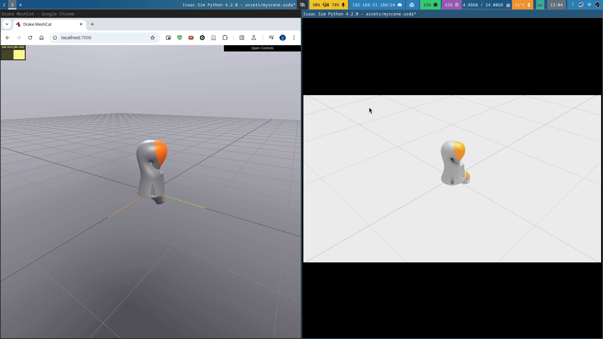

# rtxdrake

Do you use drake and want to justify your RTX graphics card purchase?

`rtxdrake` is simply a tool to visualize your Drake simulation in Isaac-Sim by intercepting LCM messages intended for meshcat and rendering them in Isaac-Sim.



## Not features (yet)

- Works only with one type of mesh objects, there are many more, but I plan to add them in the future.

## Installation

I describe the installation process [here](docs/setup_notes.md)

## Usage

To use `rtxdrake`, follow these steps:

1. Import the necessary modules:

   ```python
   from rtxdrake import do_work
   ```

2. Initialize the simulation app and load the scene:

   ```python
   from isaacsim import SimulationApp
   import omni.isaac.core.utils.stage as stage_utils
   from omni.isaac.core import World

   simulation_app = SimulationApp({"headless": False, "width": 1920, "height": 1080})
   simulation_world = World(stage_units_in_meters=1.0)
   stage_utils.open_stage("assets/myscene.usda")
   ```

3. Run the simulation loop:
   ```python
   while simulation_app.is_running():
       do_work()
       simulation_app.update()
   ```

Then, run your Drake simulation with `DefaultVisualizer` and it should render in Isaac-Sim.

## Contributing

Contributions are welcome! Please feel free to submit a pull request or open an issue on our [GitHub repository](https://github.com/lvjonok/rtxdrake).

## License

This project is licensed under the MIT License - see the [LICENSE](LICENSE) file for details.

## Acknowledgements

- [Drake](https://drake.mit.edu/)
- [USD](https://graphics.pixar.com/usd/release/)
- [Isaac Sim](https://developer.nvidia.com/isaac-sim)
